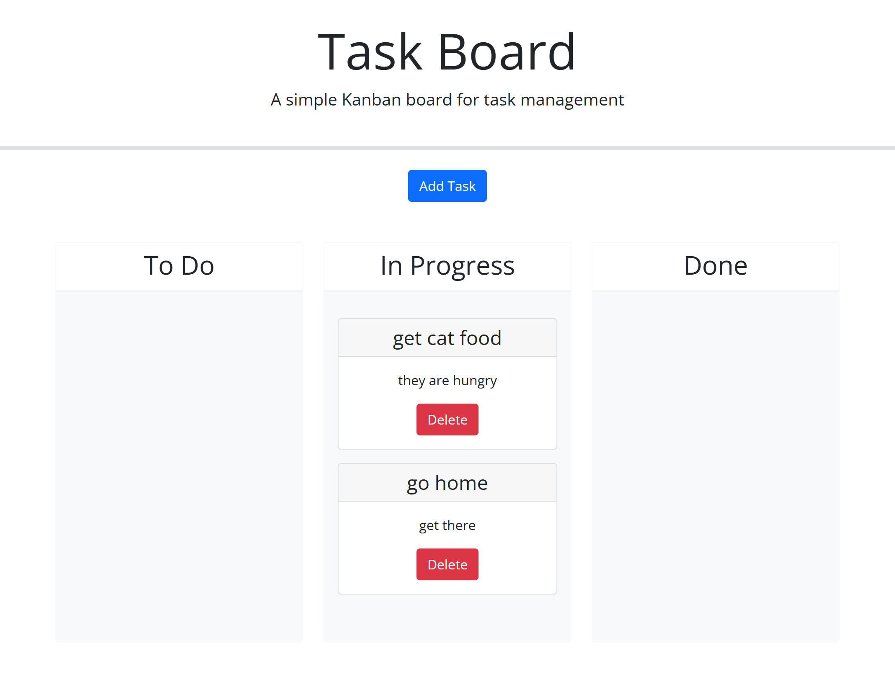

# challenge-5-taskboard
# Description

This is a task board that can you can use to track your progress. It uses bootstrap for styling and jquery for functionality. 

# Usage

You can add your task, and it will log to the local storage, but when you drag your task to in progress or done all of the tasks come together. Thats motivation to be more productive! It also should change color to indicate if it is past due or not, but that is not working. 

https://melivesel.github.io/challenge-5-taskboard/

# Credits
UT EdX course materials, especially student mini project 5. 
ExPert Learning Assistant
https://getbootstrap.com/docs/4.0/components/modal/
